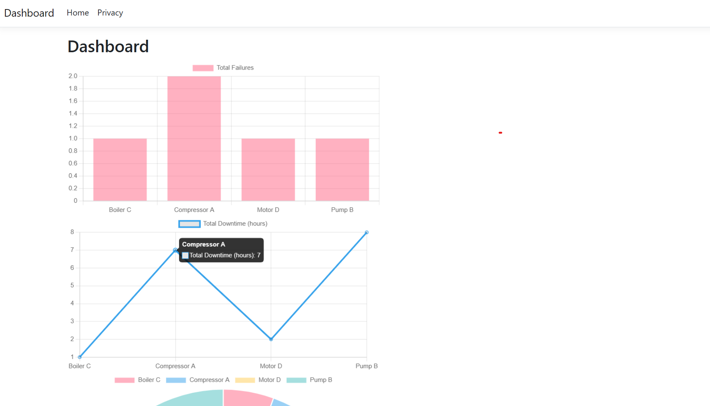
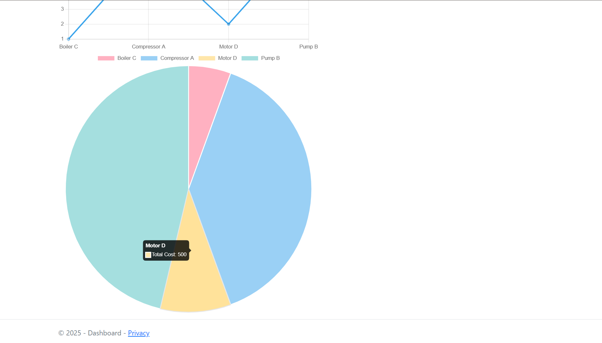

# Dashboard Project

This is a sample ASP.NET Core 8 dashboard application with SQL Server, C#, and Chart.js.  
It demonstrates a dashboard for equipment failures, downtime, and costs.

## Features

- Display **Failures per Equipment** (Bar chart)
- Display **Total Downtime per Equipment** (Line chart)
- Display **Total Cost per Equipment** (Pie chart)
- Seeded sample data in SQL Server database
- Fully responsive design with Chart.js
- Strongly-typed ViewModel architecture

## Technologies Used

- ASP.NET Core 8 MVC
- Entity Framework Core 8
- SQL Server
- Chart.js
- Razor Views

## Screenshots

**Dashboard Overview**  

**Failures Chart**  

